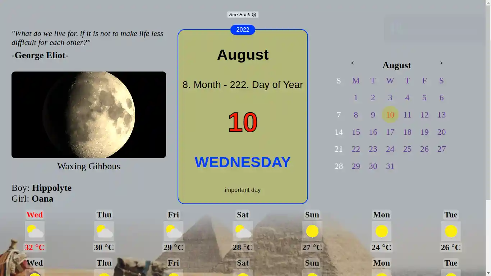

# Wall Calendar

Old fashioned wall calendar.

[Live Demo](https://harunfr.github.io/wall-calendar/) :point_left:


## Used APIs

- Random name for boys and girls
- Dessert recipe
- Forecast data
- Short stories
- Quotes
- Wikipedia API



### My Technical Take Aways

- font-size: calc(Apx + Bvw); was my magical formula when I was implementing responsive font sizes. B / A ratio represents how much responsive element is.

- There is sweet spot on B / A ratio, too much B or A can easily broke responsivenes.
  Better solution to solve responsivenes problem would be using clamp() css function.

- There was some css selector conflict which I could solve by using css modules, at that time I was near to complete application. I preferred slightly changing selector name.
  On later projects I will use modular solution like styled components or built-in module syntax.

- By using 6 different api and custom fetch hooks I have encountered side effects problem. I will solve it by
  performing every side effect on useEffect(...) body.

Note for me:
```markdown
git clone git@github.com:harunfr/wall-calendar.git && cd wall-calendar/ && code . && pnpm i && pnpm start
```